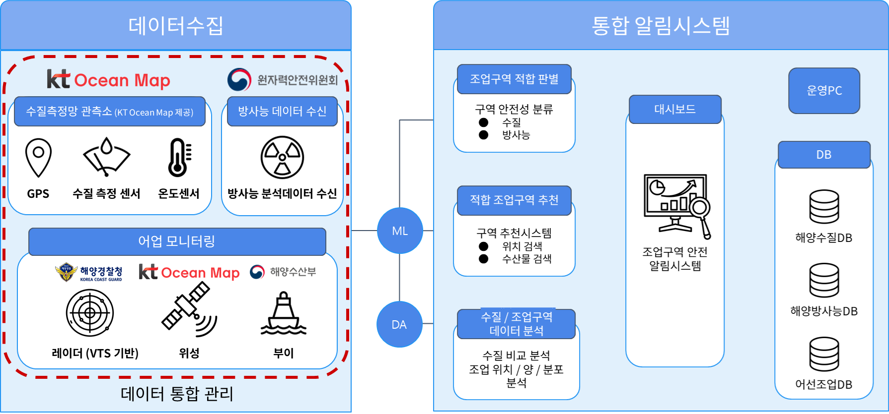
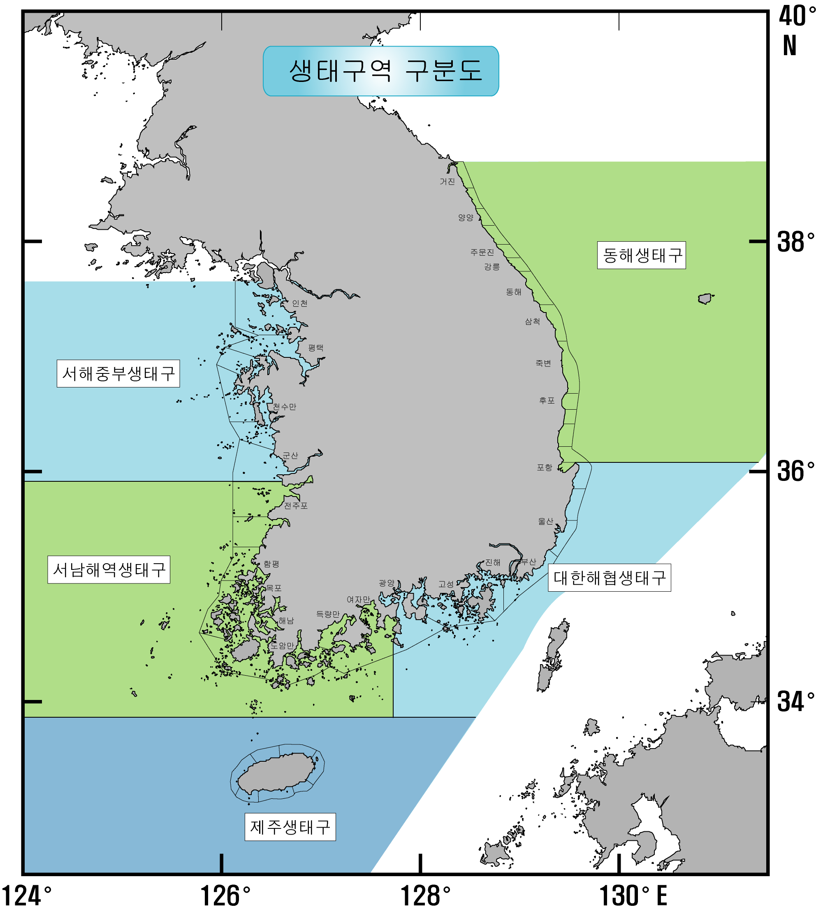

## AIVLE DX 5기 25조 IM Ocean
- ※ 본 프로젝트는 KT AIVLE 스쿨 빅프로젝트 간 작성된 코드입니다.
### 인프라 구성도

### 사용 라이브러리
1. pandas==2.2.2
2. scikit-learn=1.4.2
3. folium==0.14.0
4. streamlit==1.36.0
5. streamlit-extras==0.4.0
6. streamlit_folium==0.21.0
7. altair==5.0.1

### 국내 해양 생태구 해역 구분

> 출처: [국가법령정보센터](https://www.law.go.kr/flDownload.do?flSeq=14495017&flNm=%5B%EB%B3%84%ED%91%9C%5D+%EC%83%9D%ED%83%9C%EA%B5%AC%EB%B3%84+%ED%95%B4%EC%97%AD+%EA%B5%AC%EB%B6%84%ED%91%9C)

### 방사능 안전치 기준
| 항목         |세계보건기구 기준 먹는물 안전치 ($Bq/L$)|
|-------------|------|
| $^{134}Cs$  |10 |
| $^{137}Cs$  |10|
| $^{3}H$     |10,000|
| $^{239}Pu$  |1|
| $^{240}Pu$  |1|
| $^{90}Sr$   |10|

### 사용 데이터 및 출처
#### 수질/수온 예측 데이터
> **기상정**
> 1. AR6_SSP585_ENSMN_korea_SALNT_gridraw_monthly_2021_2040.nc(표층염도 예측 데이터 2021~2040)
> 2. AR6_SSP585_ENSMN_korea_SALNT_gridraw_monthly_2041_2060.nc(표층염도 예측 데이터 2041~2060)
> 3. AR6_SSP585_ENSMN_korea_SST_gridraw_monthly_2021_2040.nc(표층수온 예측 데이터 2021~2040)
> 4. AR6_SSP585_ENSMN_korea_SST_gridraw_monthly_2041_2060.nc(표층수온 예측 데이터 2041~2060)
#### 어업 관련 데이터
> **광주과학기술원**
> 1. 어업별 어구부이
> 2. 어업별 어선조업
> 3. 어업별 어획량
> 4. 어업별 조업 정보